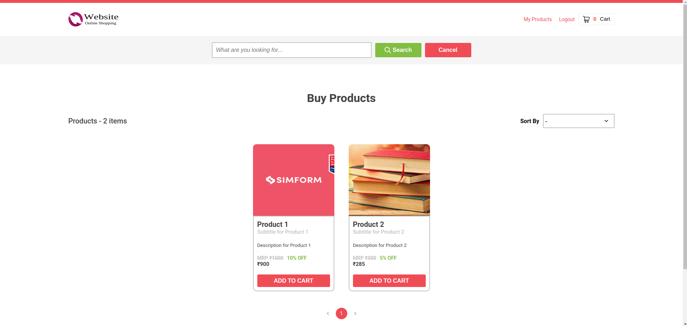
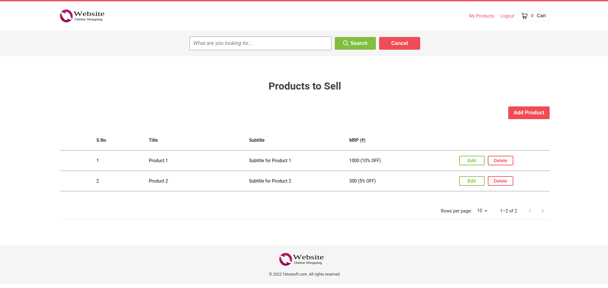
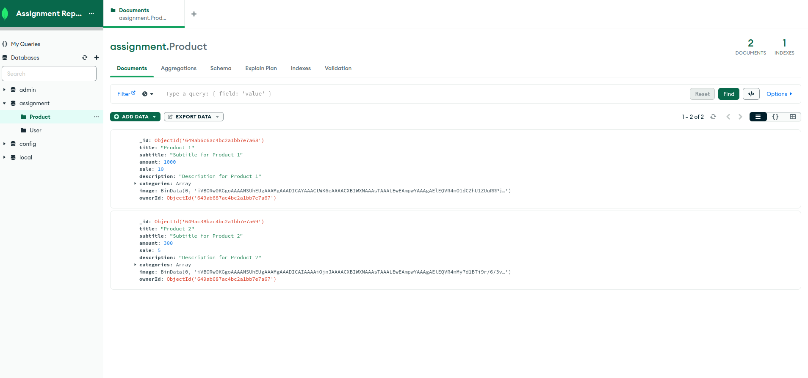
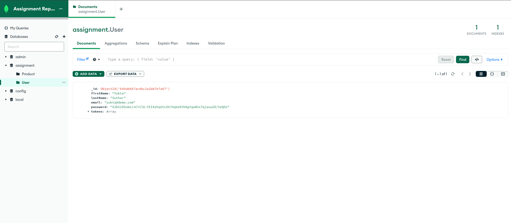

# E-Commerce Web Application

A basic E-Commerce Web Application which provides a platform to its users for buying and selling products.

## Overview

E-Commerce Web Application is as name suggests an Online Store. Users can sell and buy products on this platform, obviously. This Project uses **ReactJS** for frontend, **Redux-Toolkit** as State Management Tool, **ExpressJS** as Backend Framework, **Prisma** as ORM, **MongoDB** as Database. It has **Multer** Middleware support implemented; so APIs are capable to parse multipart-formdata and hence users can store their product images in database. It uses some UI Components from **MUI** too.

I have already deployed this Application on [Heroku](https://heroku.com)

[Click here](http://localhost:4003/dashboard) to visit E-Commerce Web Application

## Technologies Used :-
1. Node.js - Backend Dependencies
2. ReactJS - For Frontend  Dependencies 
3. MongoDB - Database
4. Prisma

##Steps to  run this project on your machine
1. Install [Node.js](https://nodejs.org/en/download) on your machine having its version over 12.0.0  To check pur node version , run this command on terminal.
   ```
   node --version

   ```
3. Clone this repository on your machine.
   ```
   git clone https://github.com/yuktasuthar01/trainee_backend_frontend/tree/master/e-commerce

   ```
4. Install dependencies for front end and back end
   ```

   npm install

   ```
5. For running Frontend
   ```
   npm run dev

   ```
7. For running Backend
   ```
    npm run start:dev

   ```
9. For running Database

   ```
   mongod --port=5000 --dbpath="data/primary" --replSet="assignmentreplica"
   mongod --port=5001 --dbpath="data/secondary2" --replSet="assignmentreplica"
   mongod --port=5002 --dbpath="data/secondary1" --replSet="assignmentreplica"

   ```
To View our website we run [Click Here](http://localhost:4003/dashboard) in our brower.


## ScreenShots/Output
 








<br>
<br>

#### Contributors:

> [Yukta Suthar](https://github.com/yuktasuthar01)
